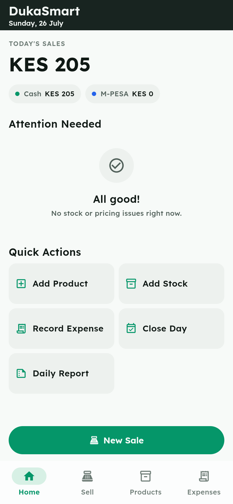
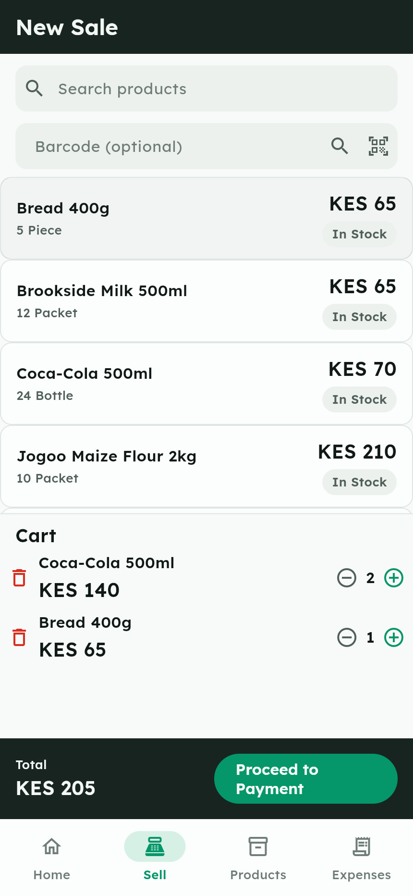
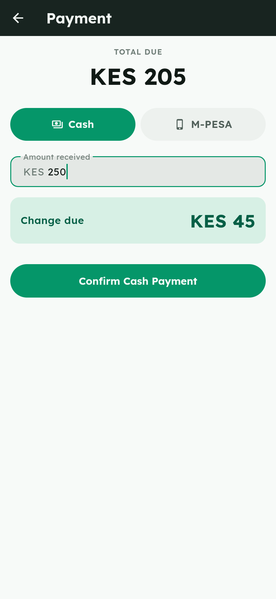
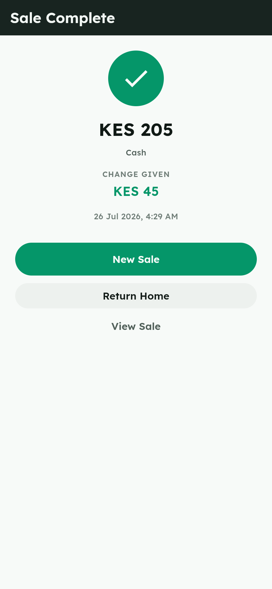

# DukaSmart

DukaSmart is an Android inventory and sales app built for a single Kenyan kiosk
owner — one owner, one kiosk, one phone, local data only ("Know your stock.
Grow your business."). It covers the full daily workflow of a small duka: add
products and opening stock, record sales (cash or M-PESA), watch stock
auto-reduce, log expenses, keep an eye on low-stock items, and close the day
with a plain-language summary of what happened and why.

## Demo

[](docs/dukasmart-promo.mp4)

*Click the preview for the full-quality MP4 ([`docs/dukasmart-promo.mp4`](docs/dukasmart-promo.mp4)).*

## Screenshots

| Dashboard | New Sale | Payment | Sale Complete |
|---|---|---|---|
|  |  |  |  |

More in [`docs/screenshots/`](docs/screenshots/) — products, expenses, add
stock, low stock, and close day.

## Prerequisites

- **Flutter 3.38.3**, installed at `~/flutter` (add to `PATH` before running
  any command below: `export PATH="$HOME/flutter/bin:$PATH"`).
- **Android SDK** at `~/Android/Sdk` (for building/running on a device).
- **Linux native test/build deps** — Drift's `sqlite3` native-asset hook needs
  a working C toolchain: install `clang`, `cmake`, and `ninja` (via Homebrew on
  Linux, or your distro's equivalents) before running `flutter test` or
  building natively.

Run `flutter pub get` once after cloning.

## Run on Chrome (fastest dev loop)

```
flutter run -d chrome --web-port=8770
```

Chrome is a time-boxed dev aid only — Drift on web loads `sqlite3.wasm` /
`drift_worker.js` from `web/`. It is not the release target.

## Run on Android

Connect a physical device via `adb` (preferred over an emulator for this
project) and confirm it's visible:

```
adb devices
flutter run -d <device-id>
```

## Release build

```
flutter build apk --release
```

The APK is written to `build/app/outputs/flutter-apk/app-release.apk`.

## Tests

```
flutter test
```

Quirk: the Drift code generator needs the JIT VM, not AOT-snapshot mode —
if `dart run build_runner build` fails or hangs on this machine, re-run it
with `--force-jit`:

```
dart run build_runner build --delete-conflicting-outputs --force-jit
```

## Seed data (first launch)

On first run (fresh database file), five demo products are seeded along with
an `openingStock` movement for each:

| Product | Buy | Sell | Stock | Unit | Threshold |
|---|---|---|---|---|---|
| Coca-Cola 500ml | 55 | 70 | 24 | Bottle | 6 |
| Brookside Milk 500ml | 55 | 65 | 12 | Packet | 5 |
| Jogoo Maize Flour 2kg | 180 | 210 | 10 | Packet | 4 |
| Sugar 1kg | 145 | 170 | 8 | Packet | 4 |
| Bread 400g | 55 | 65 | 5 | Piece | 3 |

(Prices are KES shillings for readability here; they're stored as integer
cents internally.)

## What's explicitly out of scope (MVP)

DukaSmart is a deliberately small, one-day MVP. The following are **not**
included by design:

- Auth/login, employee roles
- Customer accounts or credit
- Multi-branch support, cloud sync, or any backend
- KRA eTIMS integration
- Daraja / M-PESA API integration (M-PESA payments are recorded manually —
  amount + optional transaction code — with no live API call)
- Receipt printing (including Bluetooth printing)
- An AI assistant (the daily-report insight is rule-based, deterministic text
  — no external AI)
- Push notifications
- Data export
- Refunds or discounts
- Mixed payments (a sale is cash *or* M-PESA, not split)
- Expiry tracking
- Barcode product lookup against an external catalog
- Suppliers / purchase orders

## Project structure

```
lib/
  app/                App shell, router (GoRouter), theme
  core/
    database/         Drift schema, DAOs, enums, errors (frozen data layer)
      daos/
    formatting/        Money parsing/formatting (int-cents everywhere)
    models/            Shared DTOs (e.g. DailyMetrics, ClosedDayReport)
    widgets/           Shared widgets (SummaryCard, MoneyText, etc.)
  features/
    dashboard/         Home dashboard
    products/          Product list, Add Product, common-products catalog
    inventory/         Add Stock, Low Stock
    sales/             New Sale (POS), cart, Payment, Sale Success
    expenses/          Expense list, Record Expense
    daily_close/       Close Day, Daily Report, rule-based insight generator
  main.dart
docs/
  specs/               Requirements + design decisions (binding contracts)
  plans/               Build plan + handoff notes
test/                  Unit tests (money math, DAO invariants, close-day math,
                       insight generator) — no widget-test suite by design
```


