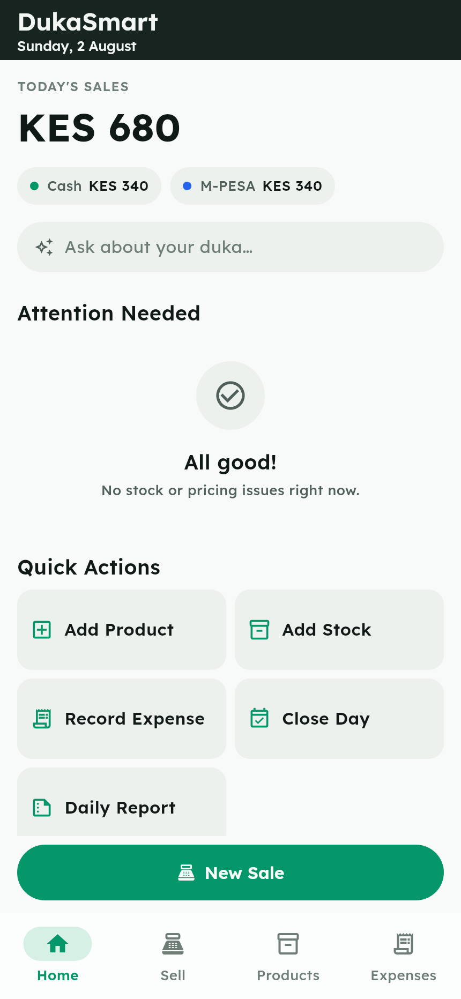
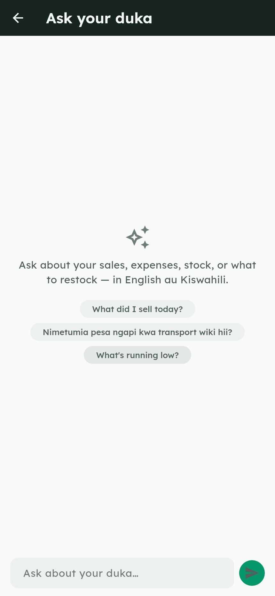

# DukaSmart

DukaSmart is an Android inventory and sales app built for a single Kenyan kiosk
owner — one owner, one kiosk, one phone, local-first data ("Know your stock.
Grow your business."). It covers the full daily workflow of a small duka: add
products and opening stock, record sales (cash or M-PESA), watch stock
auto-reduce, log expenses, keep an eye on low-stock items, and close the day
with a plain-language summary of what happened and why.

On top of that offline core sits an optional **AI layer**: *Ask your duka* —
plain-language questions answered from the shop's own numbers — and an *AI
insight* on the daily report. It is off unless deliberately built in. A build
without an Anthropic API key compiled into it renders no AI surface and makes
no network call, so nothing leaves the device. What it does, and exactly what
gets sent when it is on, is in [AI features](#ai-features-optional-online).

## Demo

[](docs/dukasmart-promo.mp4)

*Click the preview for the full-quality MP4 ([`docs/dukasmart-promo.mp4`](docs/dukasmart-promo.mp4)). There's also a
10-slide presentation deck — the source lives in [`presentation/`](presentation/)
and renders with one command. The demo walks the offline daily workflow first,
then the AI layer — the dashboard's ask bar and the Ask your duka screen.*

## Screenshots

| Dashboard | New Sale | Payment | Sale Complete |
|---|---|---|---|
|  |  |  |  |

More in [`docs/screenshots/`](docs/screenshots/) — products, expenses, add
stock, low stock, and close day.

### The AI layer

These two are from a build with a key compiled in — which is why the dashboard
carries an "Ask about your duka…" bar that the shot above does not. That is
the actual difference the AI layer makes to the UI:

| Dashboard (AI build) | Ask your duka |
|---|---|
|  |  |

**Still missing: an answered question and the daily report's AI insight
card.** Both need a *valid* key, not just any key — the surfaces render as
soon as a key is present, but the content only exists once a real call
returns. Capturing them is a live-key run away; the rig and the command are in
[`docs/screenshots/CAPTURE.md`](docs/screenshots/CAPTURE.md).

The [promo video](#demo) above now includes these two AI screens as ordinary
beats, right after the core walkthrough.

## Features

**The daily workflow — always on, fully offline:**

- **Dashboard** — today's sales, the cash vs M-PESA split, and what needs
  attention
- **New Sale (POS)** — tap or search a product, or scan its barcode; live cart
  totals; stock cannot go negative
- **Payment** — cash, with change computed the moment the amount is entered, or
  M-PESA recorded manually (amount + optional transaction code; no Daraja call)
- **Products** — add a product with profit-per-unit previewed as you type, or
  pull one from the common-products catalog
- **Stock** — opening stock, restocks that track the till cash-out, automatic
  reduction on every sale, and a low-stock list against per-product thresholds
- **Expenses** — log what went out, by category and free-text reason
- **Close Day** — gross, COGS, net, expected vs actual cash, and a
  deterministic plain-language summary of what happened and why

**The AI layer — optional, online, off unless built in:**

- **Ask your duka** — ask the shop a question in plain language; the figures
  come from your own ledger through read-only queries, the wording comes from
  the model
- **AI insight on the daily report** — a short read of the day's close, added
  *on top of* the rule-based summary, which never goes away

Without a compiled-in key neither surface renders and no network call is
reachable — the app is the unchanged offline app. Details, limits, and the
full list of what leaves the device are in
[AI features](#ai-features-optional-online).

## Prerequisites

- **Flutter 3.38.3**, installed at `~/flutter` (add to `PATH` before running
  any command below: `export PATH="$HOME/flutter/bin:$PATH"`).
- **Android SDK** at `~/Android/Sdk` (for building/running on a device).
- **Linux native test/build deps** — Drift's `sqlite3` native-asset hook needs
  a working C toolchain: install `clang`, `cmake`, and `ninja` (via Homebrew on
  Linux, or your distro's equivalents) before running `flutter test` or
  building natively.

Run `flutter pub get` once after cloning.

## Run on Chrome (fastest dev loop)

```
flutter run -d chrome --web-port=8770
```

Chrome is a time-boxed dev aid only — Drift on web loads `sqlite3.wasm` /
`drift_worker.js` from `web/`. It is not the release target.

## Run on Android

Connect a physical device via `adb` (preferred over an emulator for this
project) and confirm it's visible:

```
adb devices
flutter run -d <device-id>
```

## AI features (optional, online)

### What the two surfaces do

| Surface | Where it lives | What it does |
|---|---|---|
| **Ask your duka** | Dashboard → the "Ask about your duka…" bar (route `/home/ask`) | A question-and-answer thread over the shop's own numbers. The model answers by calling the five read-only tools listed below against the local database, so figures come from the ledger rather than from the model's guesswork. The empty state offers suggestion chips ("What did I sell today?", "What's running low?"). The thread is session-only — leaving the screen clears it. |
| **AI insight** | Daily Report, in a card below the ledger | One short paragraph reading the day that just closed. It appears *in addition to* the deterministic rule-based insight, never instead of it. A successful insight is cached for the app session so reopening the same report does not re-bill the call. On any failure the card simply does not render — there is no AI error state on that screen. |

**Language:** the ask screen invites "English au Kiswahili" and the system
prompt instructs the model to reply in whichever language the question was
asked in. A test covers UTF-8 handling, but **nobody has yet asked a Swahili
question against a real key** — treat Swahili as designed-for, not verified.

### How it is switched on

DukaSmart's AI features activate only when an Anthropic API key is compiled
into the build. This is a decision made by whoever builds the app, not a
setting the shop owner can toggle at runtime; there is no in-app switch:

```
flutter run -d <device-id> --dart-define=ANTHROPIC_API_KEY=sk-ant-...
```

Without the define, the app is the unchanged offline app: no AI surfaces
render and no network calls are made. The key is baked into that build
only — do not distribute an APK built with a real key. All AI tools are
read-only; the AI never writes to the database. Money figures are computed
locally by the app and passed to the model, which is instructed to quote
them verbatim — the app does not re-validate the wording it gets back, so
treat AI prose as a summary and the app's own screens as authoritative. The daily
report always renders its original rule-based, deterministic insight, with the
AI card below it — the rule-based summary is not a fallback that shows up only
when AI is missing, it is always there, and it is the only thing there when no
key is compiled in or the device has no connectivity.

### What leaves the device

**Privacy:** when AI features are active, these are sent to Anthropic's
API — the user's question, the conversation thread, the results of the
read-only tools, and the daily-close snapshot.

"Tool results" is not only aggregates, so be specific. The five tools send:

| Tool | What goes over the wire |
|---|---|
| `salesSummary` | period totals — sales, cash/M-PESA split, counts |
| `topProducts` | per-product rows: name, quantity sold, revenue |
| `expensesSummary` | totals grouped by category and by free-text reason |
| `stockLevels` | a product count, plus one row per product: name, quantity, unit, low-stock threshold, is-low flag |
| `dailyCloses` | the stored close rows in full — date, sales, expenses, COGS, gross profit, net result, expected/actual cash, difference |

So individual product names and stock positions do leave the device;
individual sale and expense transactions do not. DukaSmart holds no customer
data, so none is sent. `lib/core/ai/ai_query_service.dart` is the definitive
list — check it there rather than trusting this table if the two disagree.

Nothing is transmitted at all when no key is compiled in. Use a scoped /
expiring demo key for any live demo and revoke it afterward.

### Known gaps

**Android `INTERNET` permission:** the Android release/profile manifest carries the
`INTERNET` permission needed to reach the API from a real device build,
but this has only been verified by static inspection of the manifest —
it has not been exercised end-to-end on an Android profile/release build
in this environment (no device was available). Verify on-device before a
real demo. The Chrome dev target does not exercise Android permissions at
all.

**Swahili replies:** prompted for and offered in the UI, never exercised
against a real key (see *Language* above).

**No screenshots of the AI screens:** both surfaces need a compiled-in key to
render, so neither has been photographed yet. See
[Screenshots](#screenshots).

## What's next — the camera (planned, not shipped)

The notebook does not disappear on day one, so the fastest way into the app
is to photograph what the owner has already written. Two features are planned
on top of the extraction plumbing:

| Feature | What it will do |
|---|---|
| **Snap a supplier receipt** | Photograph the receipt; the lines come back as products and quantities to check, correct, and receive into stock in one confirm |
| **Import the notebook** | Photograph a handwritten catalog page; names and prices become new products, instead of being typed one at a time |

**Neither ships today, and this is the honest status.** What *is* merged and
tested: the extraction schemas (`lib/core/ai/extraction_schemas.dart`), the
image decode/resize/re-encode pipeline (`lib/core/capture/`), and vision
support in the Anthropic gateway. What does not exist: either screen. There is
no camera flow for receipt or notebook extraction. (The barcode scanner on Add
Product and New Sale is a separate, shipping feature.)

Neither is in flight. Both are blocked on an accuracy gate that has not run
yet: whether the model can actually read a real Kenyan printed receipt — and,
harder, real handwriting — is being answered by a spike against real photos
first. Handwriting is the half most likely to fail. If it does, the gate records
that result rather than quietly substituting a bigger model, and whether to
defer notebook import, pay for a stronger model, or drop it is a deliberate
call made on the measured numbers.

When built, the photo would be sent to Anthropic for extraction. DukaSmart
would not retain it or store it in the database, though the system photo picker
may keep a temporary copy in the OS cache.

## Release build

```
flutter build apk --release
```

The APK is written to `build/app/outputs/flutter-apk/app-release.apk`.

## Tests

```
flutter test
```

269 tests, all passing. `flutter analyze` reports no issues. This includes
widget tests (dashboard, ask, add_stock, close_day, record_expense, and
daily_report screens) alongside the unit tests.

Quirk: the Drift code generator needs the JIT VM, not AOT-snapshot mode —
if `dart run build_runner build` fails or hangs on this machine, re-run it
with `--force-jit`:

```
dart run build_runner build --delete-conflicting-outputs --force-jit
```

## Seed data (first launch)

On first run (fresh database file), five demo products are seeded along with
an `openingStock` movement for each:

| Product | Buy | Sell | Stock | Unit | Threshold |
|---|---|---|---|---|---|
| Coca-Cola 500ml | 55 | 70 | 24 | Bottle | 6 |
| Brookside Milk 500ml | 55 | 65 | 12 | Packet | 5 |
| Jogoo Maize Flour 2kg | 180 | 210 | 10 | Packet | 4 |
| Sugar 1kg | 145 | 170 | 8 | Packet | 4 |
| Bread 400g | 55 | 65 | 5 | Piece | 3 |

(Prices are KES shillings for readability here; they're stored as integer
cents internally.)

## What's explicitly out of scope (MVP)

DukaSmart is a deliberately small, one-day MVP. This list describes that
original one-day baseline; the optional AI layer described above was added
afterward and is documented there, not here. The following are **not**
included by design:

- Auth/login, employee roles
- Customer accounts or credit
- Multi-branch support, cloud sync, or any backend
- KRA eTIMS integration
- Daraja / M-PESA API integration (M-PESA payments are recorded manually —
  amount + optional transaction code — with no live API call)
- Receipt printing (including Bluetooth printing)
- Push notifications
- Data export
- Refunds or discounts
- Mixed payments (a sale is cash *or* M-PESA, not split)
- Expiry tracking
- Barcode product lookup against an external catalog
- Suppliers / purchase orders

## Project structure

```
lib/
  app/                App shell, router (GoRouter), theme
  core/
    ai/                Anthropic gateway, tool definitions, extraction
                       schemas, snapshot builder
    capture/           Image decode / resize / re-encode for vision calls
    database/         Drift schema, DAOs, enums, errors (frozen data layer)
      daos/
    formatting/        Money parsing/formatting (int-cents everywhere)
    models/            Shared DTOs (e.g. DailyMetrics, ClosedDayReport)
    widgets/           Shared widgets (SummaryCard, MoneyText, etc.)
  features/
    assistant/         Ask your duka screen + controller
    dashboard/         Home dashboard
    products/          Product list, Add Product, common-products catalog
    inventory/         Add Stock, Low Stock
    sales/             New Sale (POS), cart, Payment, Sale Success
    expenses/          Expense list, Record Expense
    daily_close/       Close Day, Daily Report, rule-based insight generator
  main.dart
docs/
  specs/               Requirements + design decisions (binding contracts)
  plans/               Build plan + handoff notes
test/                  Unit and widget tests (money math, DAO invariants,
                       close-day math, insight generator, dashboard, ask,
                       add_stock, close_day, record_expense, daily_report)
```


